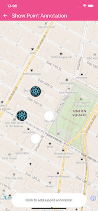
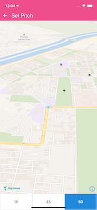

# Flightmap Maps SDK for React Native - A React Native library for building maps with the [FLightmap Maps SDK for iOS](https://github.com/jungleworks/FlightmapSDKDemo-iOS) and [Flightmap Maps SDK for Android](https://github.com/jungleworks/FlightmapSDKDemo-Android)

  <br/>
    

## Installation

**Dependencies**

- [node](https://nodejs.org)
- [npm](https://www.npmjs.com/)
- [React Native](https://facebook.github.io/react-native/) (0.60+)

**Npm**

```
npm install @react-native-flightmap-gl/flightmap --save
```

## Installation Guides

## Android
in your Project module gradle root under allprojects 
```
 {
repositories { 
jcenter() 
maven { url 'https://dl.bintray.com/flightmap/com.flightmap' }
maven { url 'https://dl.bintray.com/flightmap/flightmapnavigationsdk' }
maven { url 'https://dl.bintray.com/flightmap/flightmapjavasdk' } 
} 
}
```
## iOS
If you are using autolinking feature introduced in React-Native `0.60.0`, you just need `npm install @react-native-flightmap-gl/flightmap`, followed by `pod install` from the `ios` directory.

### CocoaPods
To install with CocoaPods, add the following to your `Podfile`:

```ruby
  # Flightmap
  pod 'react-native-flightmap-gl', :path => '../node_modules/@react-native-flightmap-gl/flightmap'

```

Then run `pod install` and rebuild your project.
## Getting Started

Congratulations, you successfully installed react-native-flightmap-gl/flightmap! 🎉
Where to go from here?

### Setting your accessToken

In order to work, flightmap requires you to create an accessToken and set it in your app.
If you haven't created one yet, make sure to sign up for an account [here](https://app.flightmap.io)
Once you have your accessToken, set it like this

```js
import FlightmapGL from "@react-native-flightmap-gl/flightmap";

FlightmapGL.setAccessToken("<YOUR_ACCESSTOKEN>");
```

### Setting connection status [Android only]

If you are hosting styles and sources on localhost, you might need to set the connection status manually for flightmap to be able to use them.

Manually sets the connectivity state of the app, bypassing any checks to the ConnectivityManager. Set to `true` for connected, `false` for disconnected, and `null` for ConnectivityManager to determine.

```js
import FlightmapGL from "@react-native-flightmap-gl/flightmap";

FlightmapGL.setConnected(true);
```

### Style URL
Default: https://maps.flightmap.io/styles//style-bright.json?fm_token=<YOUR_ACCESS_TOKEN>
Dark: https://maps.flightmap.io/styles//style-dark.json?fm_token=<YOUR_ACCESS_TOKEN>


### Show a map

```js
import React, { Component } from "react";
import { StyleSheet, View } from "react-native";
import FlightmapGL from "@react-native-flightmap-gl/flightmap";

FlightmapGL.setAccessToken("<YOUR_ACCESSTOKEN>");

const styles = StyleSheet.create({
  page: {
    flex: 1,
    justifyContent: "center",
    alignItems: "center",
    backgroundColor: "#F5FCFF"
  },
  container: {
    height: 300,
    width: 300,
    backgroundColor: "tomato"
  },
  map: {
    flex: 1
  }
});

export default class App extends Component {
  componentDidMount() {
    FlightmapGL.setTelemetryEnabled(false);
  }

  render() {
    return (
      <View style={styles.page}>
        <View style={styles.container}>
          <FlightmapGL.MapView 
		  styleURL = '<YOUR_STYLE_URL>'
		  style={styles.map} />
        </View>
      </View>
    );
  }
}
```


